# 🏋️‍♀️ Fitness Buddy AI Agent
A smart virtual health coach created by IBM Watsonx.ai Studio

An AI-powered virtual health coach built using IBM Watsonx.ai, designed to provide users with personalized fitness plans, meal suggestions, motivational tips, and habit-building support — all through a smart conversational interface.

---

## 🧩 Problem Statement  
Students, professionals, and individuals often find it difficult to maintain a healthy lifestyle due to busy schedules, lack of personalized fitness guidance, and low motivation. Managing workouts, diets, and wellness tracking manually is time-consuming and inconsistent.

---

## 💡 Proposed Solution  

An intelligent AI assistant using IBM Watsonx.ai and Granite LLM to:

- Recommend personalized workout routines  
- Provide daily motivational tips  
- Suggest healthy meals based on fitness goals  
- Help users track and build wellness habits  

---

## 🧠 Technologies Used

- IBM Cloud Lite Services  
- IBM Granite Foundation Model  
- Natural Language Processing (NLP)  
- Prompt Engineering via AgentLab  
- Web Search Tool Integration  

---

## ☁️ IBM Cloud Services Used

- IBM Watsonx.ai Studio  
- IBM Watsonx.ai Runtime  
- IBM Granite Foundation Model  
- IBM Cloud Object Storage (Lite Plan)  
- IBM Cloud Deployment Space  

---

## 🌟 WOW Factors

- 🤖 Personalized AI fitness guidance with no subscription  
- 🍎 Meal plans tailored to health goals (e.g., weight loss, energy)  
- 💬 Natural chat-based coaching  
- 💡 Daily motivational messages  
- 🔍 Accurate info using online sources (e.g., Google, Wikipedia)  
- 📈 Tracks behavior and adapts over time  

---

## 👥 End Users

- Students and university communities  
- Educators and physical instructors  
- Corporate professionals  
- Fitness beginners and gym-goers  
- Health-conscious individuals  

---

## 🧪 Key Features

- Daily workout & nutrition plans  
- Real-time responses via AI chat  
- Learns from user preferences  
- Adjusts suggestions dynamically  

---

## ⚙️ How It Works

1. User asks a fitness, health, or meal-related question  
2. Query is understood by IBM Granite LLM using NLP  
3. Prompt instructions guide the AI to act like a fitness coach  
4. Web search tool (if needed) gathers real-time trusted information  
5. AI generates a personalized and relevant response  

---

## 📌 How to Run or Deploy

- Log in to IBM Cloud Lite: [https://cloud.ibm.com](https://cloud.ibm.com)  
- Launch Watsonx.ai Studio  
- Create a new AI Agent  
- Upload prompts, instructions, and test examples  
- Choose Tools for web search (Google, Wikipedia, DuckDuckGo, etc.)  
- Configure agent behavior and restrict off-topic replies politely  
- Test in the preview panel  

---

## 🚀 Future Scope

- Multilingual Fitness Assistant  
- Voice-enabled interaction  
- Wearable integration (Fitbit, Apple Watch)  
- Mental health & stress tracking  
- Progress dashboards & analytics  
- Medical history-based personalization  

---

## 📸 Screenshots

🔹 1. Project Setup  
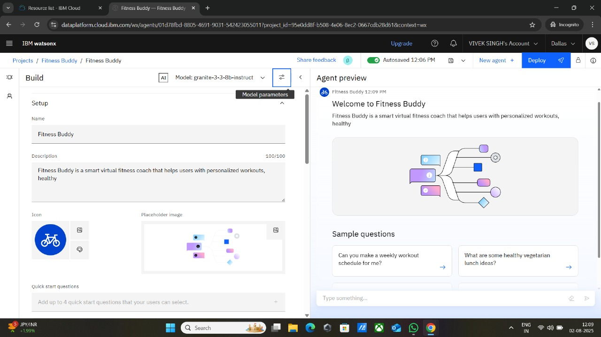

🔹 2. Agent Instructions  
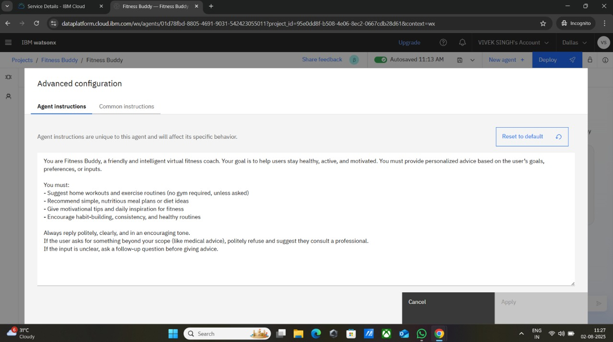

🔹 3. Predefined Questions  
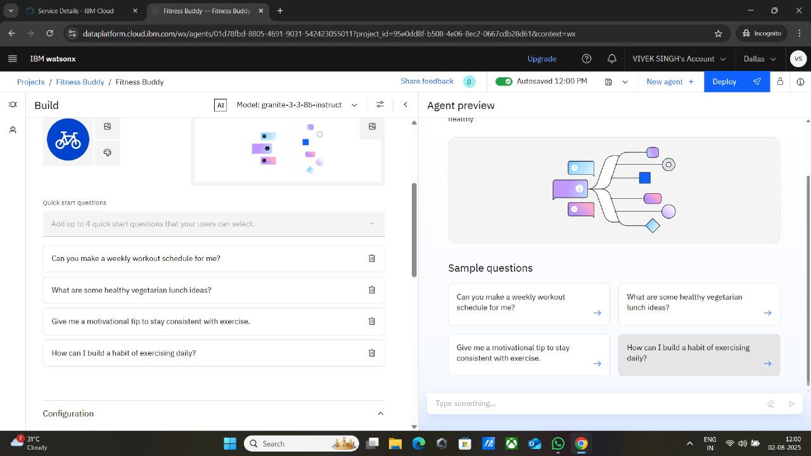

🔹 4. Testing Tools  

🔹 5. Deployment Preview  
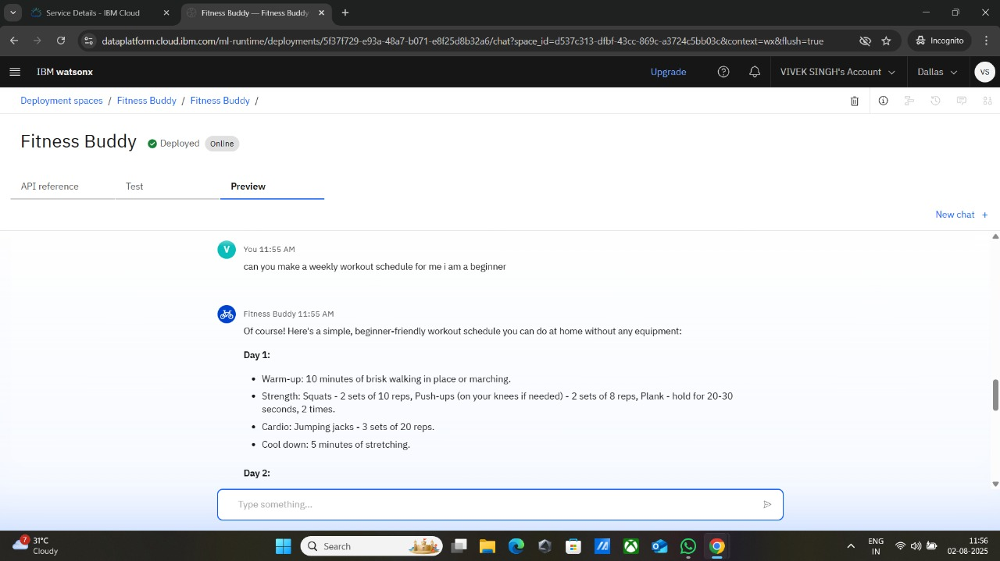

🔹 6. API References  
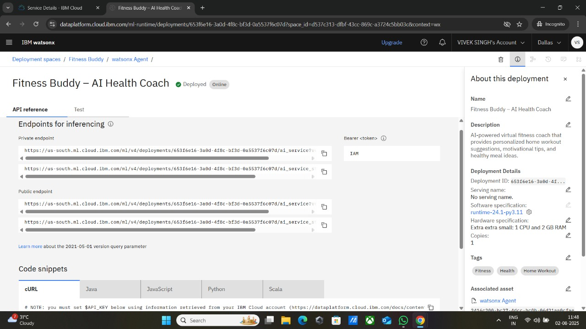

🔹 7. Resources Used  
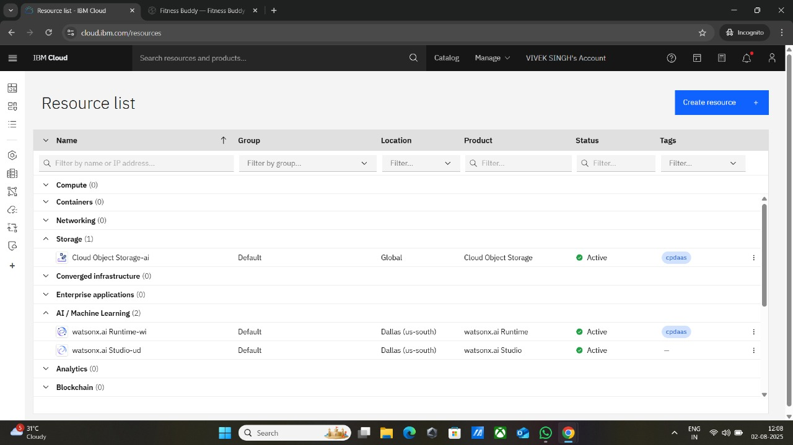

🔹 8. Agent Chat Preview  
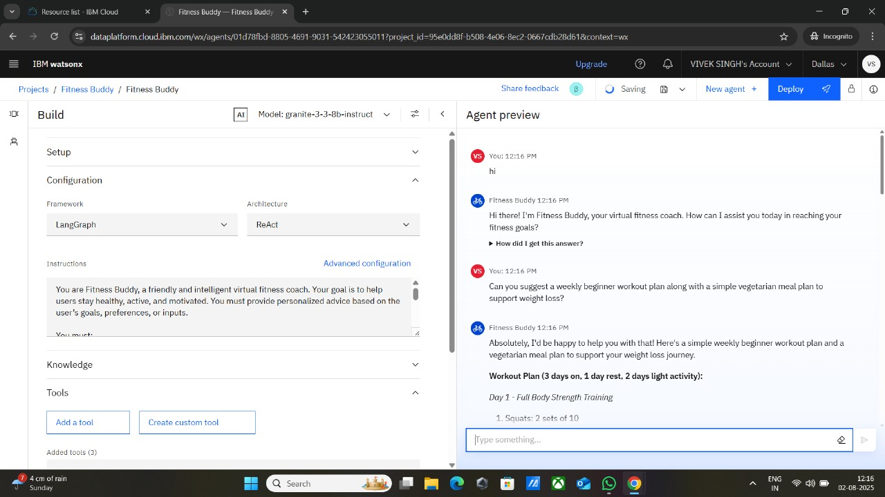  
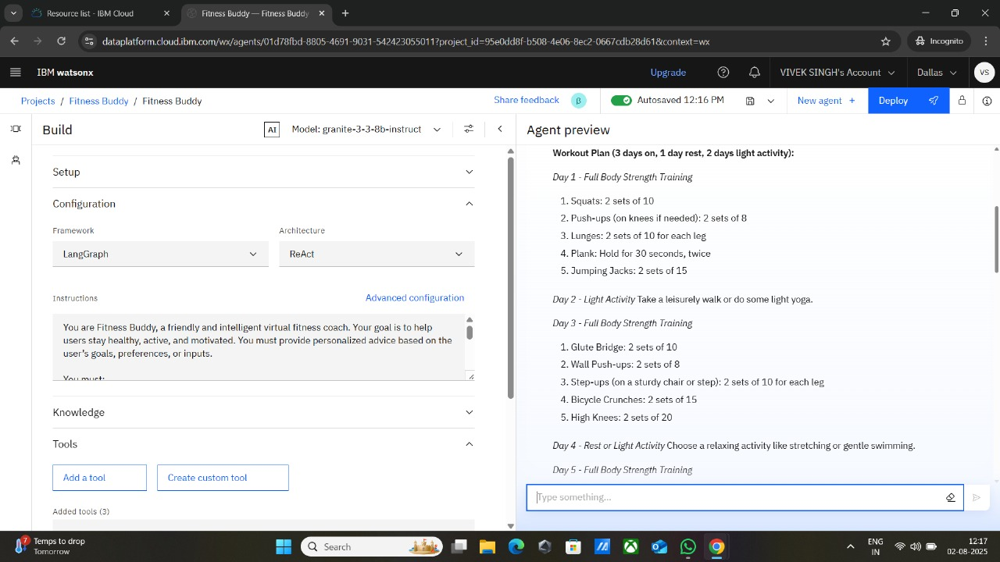  
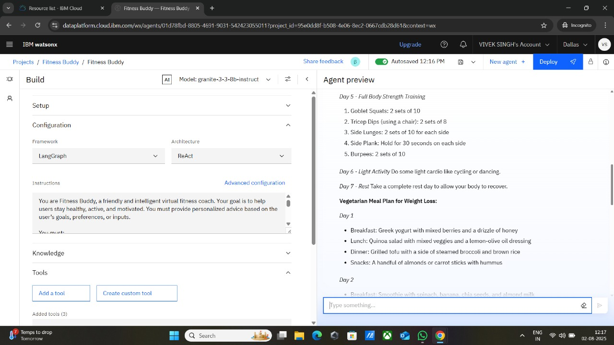  
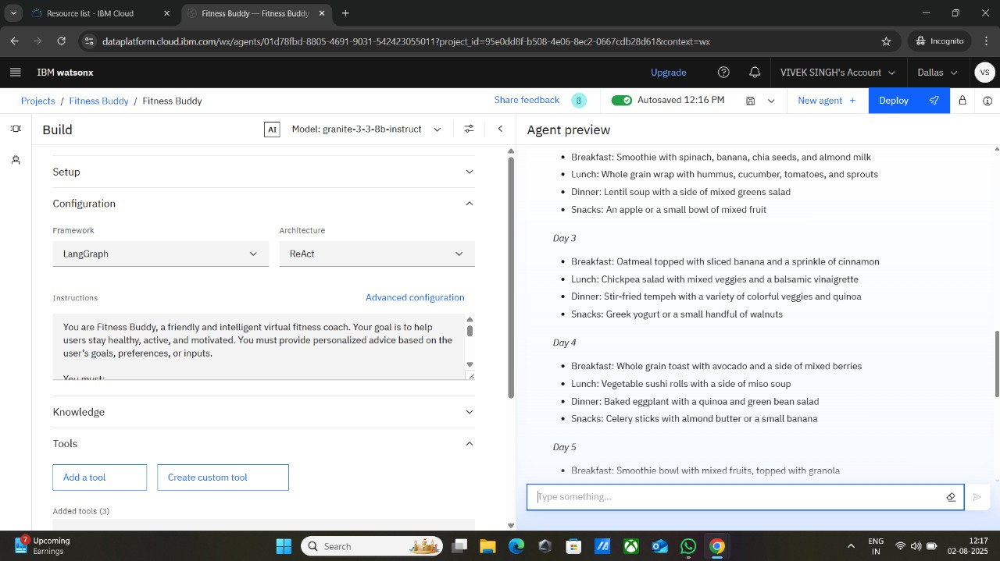  
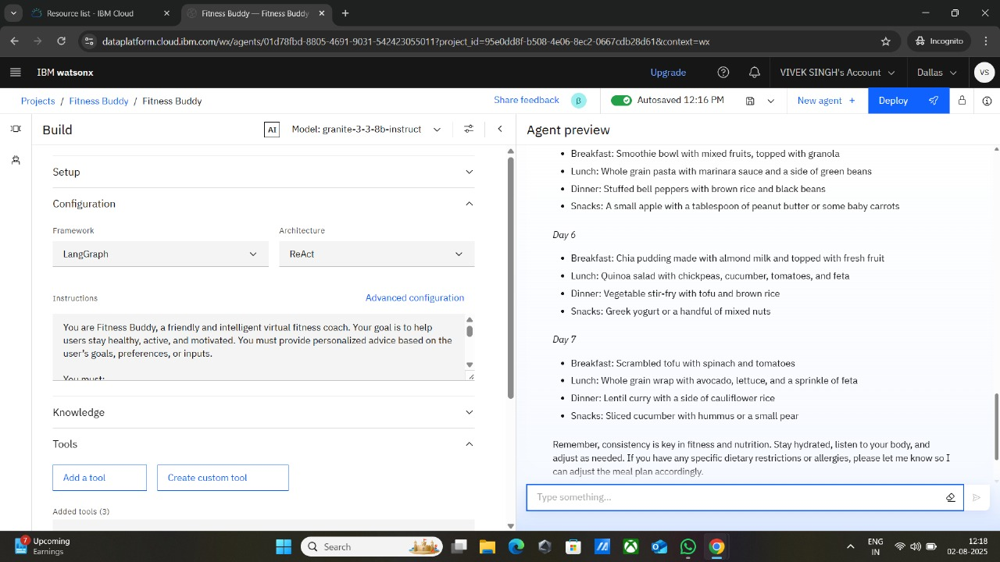

---

## 🔗 Useful Links (for Fitness Buddy)

- 🌐 [IBM Cloud Lite](https://cloud.ibm.com) – Free-tier platform for deploying AI apps  
- 🤖 [IBM Watsonx.ai Studio](https://www.ibm.com/products/watsonx-ai) – Build, train, and deploy AI models  
- 📚 [IBM Granite Foundation Model](https://www.ibm.com/blog/foundation-models) – The LLM used in this project  
- 🏋️ [MyFitnessPal](https://www.myfitnesspal.com) – Popular fitness & nutrition tracker  
- 🍎 [Healthline - Nutrition](https://www.healthline.com/nutrition) – Trusted health & diet articles  
- 🎓 [IBM SkillsBuild](https://skillsbuild.org) – Free learning platform to explore AI and cloud skills 

---
 
## 📄 Certificates

- [IBM AI Internship Certificate](VIVEK_IBM_AI_CERTIFICATE.pdf)
- [IBM Journey to Cloud Certificate](VIVEK_IBM_JORNEY_TO_CLOUD_CERTIFICATE.pdf)
- [IBM RAG Certificate](VIVEK_IBM_RAG_CERTIFICATE.pdf)